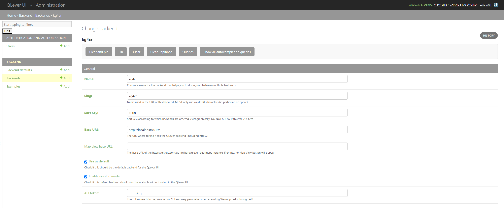

# German Court-Company Relationships Knowledge Graph

## Problem Statement

In Germany, the incorporation of companies (and subsequent changes) is handled not by a central register but by district courts (**Amtsgerichte**). Around 188 courts (out of a total of 1090+) are responsible for company registrations. This decentralized system creates several critical challenges:

- **Lack of unique identifiers**: Company registration numbers are only unique within individual court jurisdictions, not across Germany
- **Court-dependent numbering**: The same number (e.g., HRB 29) can refer to completely different companies at different courts
- **Inconsistent representation**: No official standardized way to represent these identifiers exists
- **Multiple registrations**: When a company moves headquarters from one court district to another, it receives a new identifier, causing fragmentation
- **Temporal complexity**: Court consolidations and jurisdictional changes create additional identification challenges
- **Historical discontinuity**: World War II and political regime changes severed continuity between pre-war and contemporary records

## Project Focus

This work addresses these challenges by constructing a **comprehensive multi-temporal knowledge graph** that captures court-company relationships across both **contemporary (2019-2025)** and **historical (1920-1945)** periods. 

### Dataset Composition

**Contemporary Court Registration Data:**
- All commercial, cooperative, company, association, and partnership registers referenced by XJustizID
- 188 court registration records tracking administrative transitions and consolidations
- Temporal validity tracking through `ValidUntil` and `FutureCode` fields

**Historical Company Registration Data (1920-1945):**
- 780k+ company registrations extracted from pre-WWII German newspapers using OCR
- Major German corporations: Deutsche Bank, Siemens, BMW, Daimler, I.G. Farben, Rheinmetall-Borsig
- Coverage of historical territories: Königsberg, Breslau, Gleiwitz (now Russia/Poland)
- Documents critical historical period: Weimar Republic, hyperinflation (1923-24), pre-WW2 era

**Knowledge Graph Statistics:**
- **780,000+ RDF triples** enabling complex temporal and structural queries
- Cross-temporal linkage enabling century-spanning corporate history research

## Key Features

### 1. Court Evolution Tracking
- Models court identifier transitions over time through `FutureCode` relationships
- Tracks consolidations (e.g., 10 Mecklenburg-Vorpommern courts → 5 regional centers)
- Documents causes: register type changes, jurisdictional boundary shifts, mergers, relocations

### 2. Multi-Temporal Integration
- Bridges 1920-1945 historical period with 2019-2025 contemporary administrative data
- Enables longitudinal analysis despite WWII discontinuity
- Identifies courts with continuous operation across 100+ years (München, Nürnberg, Saarbrücken)

### 3. Entity Resolution Support
- Explicit modeling of court-company relationships as first-class graph entities
- Register type classification (HRA, HRB, Genossenschaftsregister, Vereinsregister)
- Geographic jurisdiction tracking via postal codes (PLZ)

### 4. Historical Documentation
- Preserves evidence of German commercial activity in lost territories
- Documents pre-war corporate networks (Deutsche Bank's 60+ branches, Siemens corporate family)
- Captures unique organizational forms (Allianzgesellschaften - cartel arrangements)

## Technical Implementation

### Data Processing Pipeline

**Contemporary Data:**
1. Extract from XRepository court registry Excel files
2. Parse court attributes: XJustizID, RegisterType, State, PLZ, ValidUntil, FutureCode
3. Convert to RDF triples with temporal validity metadata
4. Model court evolution chains through successor relationships

**Historical Data:**
1. OCR processing of digitized pre-WWII German newspapers
2. Handle character encoding corruption (40% of entries affected by ISO-8859-1/UTF-8 issues)
3. LLM-based named entity extraction for courts, companies, registration numbers, dates
4. Structured data extraction with quality metadata and provenance tracking

**Knowledge Graph Construction:**
- Entity types: Court, Company, Register, RegistrationEvent, GeographicLocation, State
- Relationships: registeredAt, maintainsRegister, hasJurisdiction, succeededBy, consolidatedInto, hasXJustizID
- Temporal modeling: Valid-time intervals, event sequences, evolution chains

### Why QLever?

With 780,000+ triples, this knowledge graph requires efficient querying of complex temporal and structural relationships. **QLever** provides:

- **Temporal reasoning**: Efficient traversal of court evolution chains
- **Path queries**: Transitive closure over jurisdictional changes
- **Full-text search**: Company name matching despite OCR corruption
- **Performance**: less than 500ms query times for complex multi-hop queries
- **Property paths**: SPARQL 1.1 features for exploring graph structure

## How to Run the Project

### Prerequisites
- Python 3.10+
- Poetry (version 1.8.4) for dependency management
- Docker (for running QLever)
- WSL (for Windows systems)

### Setup

**Note:** 
> This repo also contains already indexed RDFs. To use them directly, you can skip steps 4–6.1 and start from step 6.2 (qlever start). 

#### 0. (Windows Only) Open WSL

#### 1. Start Docker
Start Docker engine and verify:
```bash
docker --version    # Check installation
docker info         # Verify Docker daemon is running
docker run hello-world     # Test container
```
If issues arise, check WSL permissions for Docker engine communication.

#### 2. Clone the Repository
```bash
git clone https://github.com/UB-Mannheim/Amtsgericht-KG
cd KG4CR
```

#### 3. Install Dependencies
```bash
poetry install
```

#### 4. Prepare the Data

**Contemporary Court Data:**
- Place XRepository Excel files in `data/raw_data/2025_amts_data/`

**Historical Court-registrations Data:**
- Download digitized German newspapers from the [Mannheim University Library](https://digi.bib.uni-mannheim.de/) 

- The download process is automated in the script 
```bash
python kg4cr/get_DE_newspapers/download_DE_newspapers.py
```

**Run RDF Conversion:**
```bash
python kg4cr/company_register_de/generate_rdf.py   # contemporary
python kg4cr/Extr_DE_newspapers/json2rdf.py     # historical
```

#### 5 Extract info from newsapers
---

**5.1 Set up .env**

Before running the extraction pipeline, create a `.env` file in the project root directory. 
This file stores API keys and endpoints for the LLM providers used in extraction.

Example `.env` file:

```bash
# === OpenRouter API (for OpenRouter-hosted models) ===
OPENROUTER_API_KEY=

# === Groq API (for Groq-hosted models) ===
GROQ_API_KEY=

# === MAIA API (for University of Mannheim’s MAIA LLM) ===
MAIA_API_KEY=
MAIA_URL=

# === UNI-HPC Ollama-Compatible API (Mannheim HPC cluster) ===
UNIHPC_URL=
```

**5.2 Extraction pipeline**
- Run extraction pipeline with suitable params (make sure .env file has respective LLM API key) 
```bash
python kg4cr\Extr_DE_newspapers\run_extraction_pipeline.py `
  --input ./data/raw_data/DE_newspapers_1920_45/ `
  --output ./data/processed/DE_newspapers_1920_45_processed/ `
  --log ./logs/ `
  --provider unihpc `
  --max_words 500 `
  --overlap 50 `
  --delay 2 `
  --mode parallel `
  --strict

```

#### 6. QLEVER Setup

**6.1 Index the Data Using QLever**

```bash
cd data/processed/Qlever
qlever index
```

**6.2 Start QLever Engine**
```bash
qlever start
```

**6.3 Access UI for Querying**
```bash
qlever ui
```
Access QLever at: [http://localhost:7001](http://localhost:7001)

**6.4 Integrate Backend & Start Querying**

1. Navigate to **Resources** (right corner) → **QLever UI Admin**
2. Log in: Username: `demo`, Password: `demo`
3. Go to **Backends** → **Add**
4. Configure backend settings:
   - **Name**: `German Court-Company KG`
   - **Backend URL**: `http://localhost:7001`
   - **Identifier**: `kg4cr`
   - **Description**: `Temporal knowledge graph of German court-company relationships`
5. Click **Save**
6. Return to default view and select `kg4cr` from dropdown

## Example SPARQL Queries

### Query 1: Company registration details filtered by specific court names
Retrieve all courts that underwent consolidation in 2024:

```sparql
PREFIX ex: <http://example.org/schema/>
PREFIX xsd: <http://www.w3.org/2001/XMLSchema#>

SELECT ?companyName ?courtName ?code ?year ?date
WHERE {
  ?company a ex:Company ;
           ex:companyName ?companyName ;
           ex:registeredAt ?court ;
           ex:registrationCode ?code .

  ?court ex:courtName ?courtName .

  OPTIONAL { ?company ex:registrationYear ?year . }
  OPTIONAL { ?company ex:articleDate ?date . }

  FILTER(
    REGEX(?courtName, "Aachen|Ahlen|Altenburg", "i")
  )
}
```
**Returns**: 15 Nordrhein-Westfalen courts + 18 Gesellschaftsregister reform courts

### Query 2: Historical Companies in Old Territories
Find all companies registered at courts in territories lost post-1945:

```sparql
PREFIX ex: <http://example.org/schema#>
PREFIX rdfs: <http://www.w3.org/2000/01/rdf-schema#>

SELECT ?company ?companyName ?court ?courtName ?year ?registerCode
WHERE {
    ?company a ex:Company ;
             rdfs:label ?companyName ;
             ex:registeredAt ?court ;
             ex:registrationYear ?year ;
             ex:hasRegisterCode ?registerCode .
    ?court rdfs:label ?courtName ;
           ex:lostTerritory true .
    FILTER(?year >= 1920 && ?year <= 1945)
}
ORDER BY ?courtName ?year
```

### Query 3: Count Companies per Court
Summarize how many companies are registered at each court.

```sparql
PREFIX ex: <http://example.org/schema/>
PREFIX xsd: <http://www.w3.org/2001/XMLSchema#>

SELECT ?courtName (COUNT(?company) AS ?numCompanies)
WHERE {
  ?company a ex:Company ;
           ex:registeredAt ?court .
  ?court ex:courtName ?courtName .
}
GROUP BY ?courtName
ORDER BY DESC(?numCompanies)

```

## Data Quality Considerations

### OCR Challenges (Historical Data)
- **Common errors**: Å¿→ß, ü→ü, ö→ö, ä→ä
- **Gothic/Fraktur script**: Long s (ſ) vs. f confusion
- **Mitigation**: Postprocessing after llm-based text extraction (before indexing)

### Missing Data — **Historical Gaps**

| **Year** | **Recorded Value** |
|:------------:|:--------------------:|
| 1922 | **887** |
| 1924 | **927** |
| 1932 | **13** |
| 1933 | **10** |
| 1934 | **7** |
| 1936 | **2,362** |
| 1943 | **4** |

<sub> Data shows significant disruption during WWII and early 1930s economic turmoil.</sub>


### Data Quality Metadata
All triples include provenance and quality annotations:
- Source document references in triples
- LLM-extraction Logs stored as an excel at '/logs/run_log_summary'

## Research Applications

### Legal Research
- Track company registration history across court consolidations
- Identify historical continuity despite jurisdictional changes
- Research corporate structures in pre-war Germany

### Business History
- Analyze corporate networks (Deutsche Bank, Siemens, I.G. Farben)
- Study cartel arrangements (Allianzgesellschaften)
- Document companies in lost territories for restitution research

### Administrative Studies
- Analyze court consolidation patterns and regional strategies
- Compare federal state approaches to registry modernization
- Study efficiency vs. accessibility trade-offs

### Digital Humanities
- Evaluate OCR quality on historical German newspapers
- Develop entity resolution techniques for noisy historical data
- Model temporal validity across regime changes


## Future Work

### Data Enhancement
- **OCR correction pipeline**: Character-level models trained on systematic error patterns
- **Temporal coverage extension**: Data addition to remove sparsity between 1920-1945
- **Complete contemporary coverage**: Possibility of extending extraction to pre WW1 (pre 1920)
- **Additional sources**: Trade directories, tax records, chamber of commerce archives

### Advanced Analytics
- **Machine learning entity resolution**: Train matching models on known historical-contemporary pairs
- **Network analysis**: Corporate family structures, merger/acquisition detection
- **Automated reasoning**: Consistency checking, temporal constraint validation

### Application Development
- **Web-based research platform**: SPARQL query interface, timeline visualization
- **RESTful API**: Programmatic access for integration with other systems
- **Linked Open Data publication**: Federated queries with European company databases
- **Crowdsourcing tools**: Manual validation interface for OCR correction

### Integration
- **Modern Handelsregister API**: Real-time contemporary company data
- **OpenCorporates linking**: International company data integration
- **European Business Register**: Cross-border company identification
- **Wikidata alignment**: Enrich with additional structured data

## Contributing

We welcome contributions in several areas:

1. **OCR Correction**: Help validate and correct historical company names
2. **Entity Linking**: Identify matching companies across historical/contemporary periods
3. **Data Sources**: Suggest additional historical sources (newspapers, directories, archives)
4. **Query Development**: Share useful SPARQL queries for research applications
5. **Visualization**: Create tools for exploring court evolution and corporate networks

## License

**Data**: please refer to repective pages for license information. 
- Contemporary court data: Derived from [XRepository](https://www.xrepository.de/details/urn:xoev-de:xunternehmen:codeliste:registergerichte) public registry
- Historical company data: Extracted from University of Mannheim managed [Reichanzeiger](https://digi.bib.uni-mannheim.de/periodika/reichsanzeiger/) newspapers

**Code**: Available under [MIT License](LICENSE)

## Acknowledgments

- **XRepository** for providing structured contemporary court registration data
- **OpenCorporates** for highlighting German company identification challenges
- **University of Freiburg** for QLever SPARQL engine
- Digital newspaper archives for preservation of historical sources
- Contributors who validated OCR extractions and entity linkages

## Contact

For questions, suggestions, or collaboration inquiries:
- **GitHub Issues**: [Report bugs or request features](https://github.com/UB-Mannheim/Amtsgericht-KG/issues)

---

**This project aims to bring transparency and continuity to Germany's decentralized company registration system by providing a structured, queryable, and historically-grounded knowledge graph that bridges more than a century of administrative and political changes.**